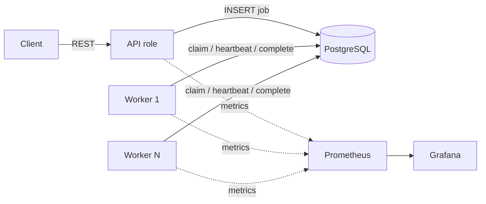
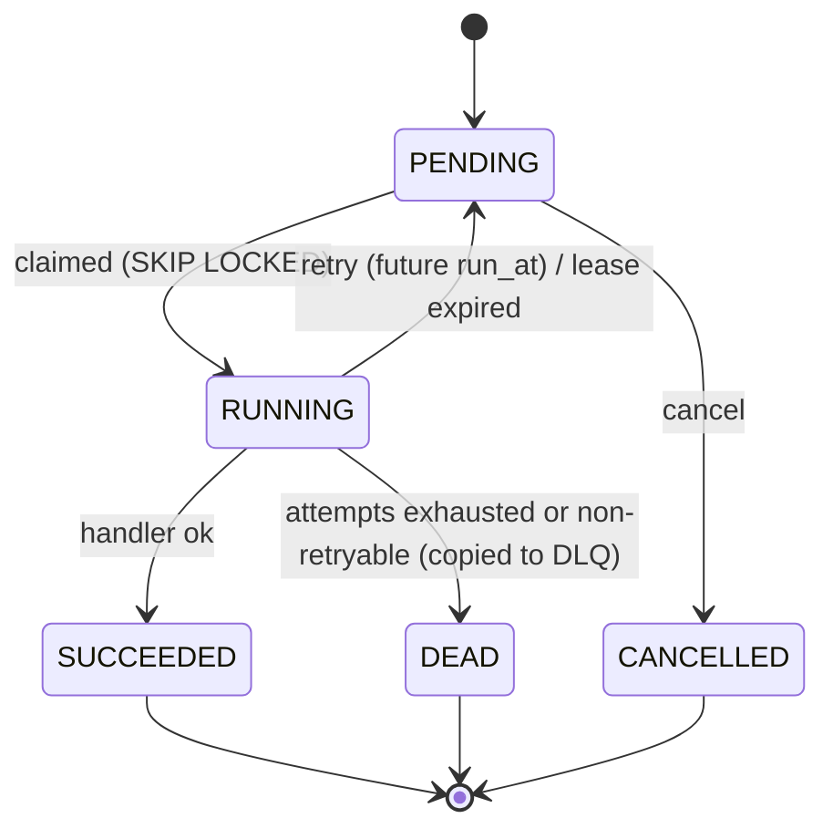

# Durable Job Queue

[](https://github.com/Octavian-Mihai/job-queue/actions/workflows/ci.yml)

A durable, horizontally scalable background job queue built on PostgreSQL alone (no Redis/Kafka),
in Java 21 + Spring Boot. Workers claim jobs with `SELECT ... FOR UPDATE SKIP LOCKED`, hold
heartbeat-extended leases, retry with exponential backoff and jitter, and dead-letter jobs that
exhaust their attempts. The goal is correctness under failure, backed by measured results.

> **Status: phase 4 of 9 (retries, backoff, DLQ).** Jobs are enqueued, claimed by concurrent
> workers, retried with exponential backoff + jitter, and dead-lettered with inspect/replay.
> Leases, heartbeats, the reaper and graceful shutdown (phase 5) are not built yet: a job whose
> worker crashes stays `RUNNING`. Sections grow as phases land.

## Architecture



One codebase, two roles chosen by `JOBQUEUE_ROLES` (`api`, `worker`, or `api,worker`).

## Job state machine



## Quickstart

```bash
docker compose up --build --scale worker=4
curl localhost:8080/actuator/health
```

Enqueue and inspect (OpenAPI docs: `http://localhost:8080/swagger-ui/index.html`):

```bash
curl -i -XPOST localhost:8080/jobs -H 'Content-Type: application/json' \
  -H 'Idempotency-Key: order-42-welcome-email' \
  -d '{"type":"send-email","payload":{"to":"a@b.c"},"priority":5,"delaySeconds":10,"maxAttempts":3}'
# repeat the same command: 200 with the same job instead of 201 and a duplicate

curl localhost:8080/jobs/<id>                                  # job + attempt history
curl 'localhost:8080/jobs?status=PENDING&type=send-email&size=20'
curl -XPOST localhost:8080/jobs/<id>/cancel                    # 409 unless still PENDING
```

Errors are RFC 7807 `application/problem+json` (validation failures include an `errors` map).

Host ports are overridable if they clash with something else: `API_PORT`, `POSTGRES_PORT`,
`PROMETHEUS_PORT`, `GRAFANA_PORT`. Prometheus: `:9090`, Grafana: `:3000`.

Local development (needs Docker for Testcontainers):

```bash
./mvnw verify          # format check, tests against real Postgres, coverage report
./mvnw spotless:apply  # auto-format
```

## Schema notes

`jobs.priority`: higher value is claimed first. A DB `CHECK` guarantees a `RUNNING` row always has
`locked_by` and `lease_expires_at`, and no other state does. `dead_letter_jobs` has no foreign key
to `jobs` on purpose, so DLQ records survive cleanup of old job rows.

## Idempotency

`POST /jobs` with an `Idempotency-Key` header runs
`INSERT ... ON CONFLICT (idempotency_key) DO NOTHING RETURNING id` against a unique index. Two
concurrent requests serialize on the index: one inserts (201), the other waits for it, inserts
nothing, and reads the winner's row (200). There is no check-then-insert window. A test fires 32
simultaneous requests with one key and asserts exactly one row and one 201. A repeated key returns
the *existing* job even if the new request body differs (it does not compare payloads).

## Workers

A worker (`JOBQUEUE_ROLES=worker`, or both roles in one process) runs one poller thread that claims
jobs in batches and runs each on a virtual thread. A semaphore bounds in-flight jobs, and the poller
never claims more than it has free slots. When idle it backs off from `poll-interval` up to
`max-poll-interval`; a full batch triggers an immediate re-poll to drain a backlog.

The claim is one SQL statement (`JobClaimRepository.claim`): `SELECT ... FOR UPDATE SKIP LOCKED`
picks and locks runnable rows in priority order, an `UPDATE` marks them `RUNNING` with an owner,
lease and incremented `attempts`, and an `INSERT` records the `job_attempts` row, all atomically.
Completion and failure updates are **fenced** on `locked_by` and the attempt number.

| Env var | Default | Meaning |
|---|---|---|
| `JOBQUEUE_WORKER_CONCURRENCY` | 8 | max jobs running at once per process |
| `JOBQUEUE_WORKER_BATCH_SIZE` | 10 | max jobs per claim |
| `JOBQUEUE_WORKER_POLL_INTERVAL` | 200ms | poll period while busy |
| `JOBQUEUE_WORKER_MAX_POLL_INTERVAL` | 5s | idle backoff ceiling |
| `JOBQUEUE_WORKER_LEASE_DURATION` | 30s | claim validity (heartbeats arrive in phase 5) |
| `JOBQUEUE_WORKER_QUEUES` | all | comma-separated queue names to consume |

### Demo handlers

| Type | Behaviour | Payload |
|---|---|---|
| `send-email` | simulated SMTP, random transient failures; **idempotent** via `email_outbox` keyed by job id | `to`, `subject`, `simulate` (`random`/`ok`/`transient`/`after-send`) |
| `generate-report` | burns CPU then sleeps | `cpuMs`, `sleepMs` |
| `deliver-webhook` | simulated HTTP: 70% ok, 20% transient (503/timeout), 10% permanent (400/410) | `url`, `simulate` (`random`/`ok`/`transient`/`permanent`) |

Add a handler by implementing `JobHandler` as a Spring bean. Throw `RetryableException` or
`NonRetryableException` to classify failures; anything else is retried. Enqueueing an unknown
`type` is rejected with 400.

## Retries, timeouts and the dead-letter queue

**Backoff** (`BackoffPolicy`, pure and unit-tested): after failed attempt *n* the delay is uniform in
`[0, min(max-delay, base-delay x multiplier^(n-1))]`, i.e. exponential with **full jitter** and a
cap. Jitter keeps jobs that failed together from retrying in synchronized waves; the trade-off is that a
single retry can be nearly immediate. Settings are per job type with fallback to defaults
(`jobqueue.retry.defaults.*`, `jobqueue.retry.types.<type>.*`: `base-delay`, `multiplier`,
`max-delay`, `max-attempts`, `execution-timeout`) and are validated at startup. A request's
`maxAttempts` overrides the type default.

**Classification** (`FailureClassifier`): `NonRetryableException` goes straight to the DLQ,
`RetryableException` retries, and **anything unknown is retried** (dead-lettering on an unanticipated
bug would lose work a later attempt or a deploy may complete). The nearest classified exception in the
cause chain wins.

**Timeouts:** each attempt runs under its type's `execution-timeout`. On expiry the job's thread is
interrupted and the attempt is recorded as `TIMED_OUT` (a failed, retryable attempt). A handler that
ignores interruption keeps its slot busy (Java cannot kill a thread), which bounds concurrency and
prevents an overlapping second run of the same job.

**Dead-letter queue:** when a job dies (`NON_RETRYABLE` or `MAX_ATTEMPTS_EXCEEDED`) it is copied to
`dead_letter_jobs` in the same transaction as the status change. Replay creates a **new job** with a
fresh attempt cycle, marks the entry `replayed_at`/`replayed_job_id`, and leaves the original DEAD job
as history. One atomic statement with `replayed_at IS NULL` + `FOR UPDATE SKIP LOCKED` makes
double-replay impossible even under concurrent requests.

```bash
curl 'localhost:8080/dlq?type=deliver-webhook&reason=MAX_ATTEMPTS_EXCEEDED&replayed=false'
curl localhost:8080/dlq/<id>                       # entry + full attempt history
curl -XPOST localhost:8080/dlq/<id>/replay         # 201 new job, 409 if already replayed
curl -XPOST 'localhost:8080/dlq/replay?type=deliver-webhook&limit=500'   # oldest first
```
