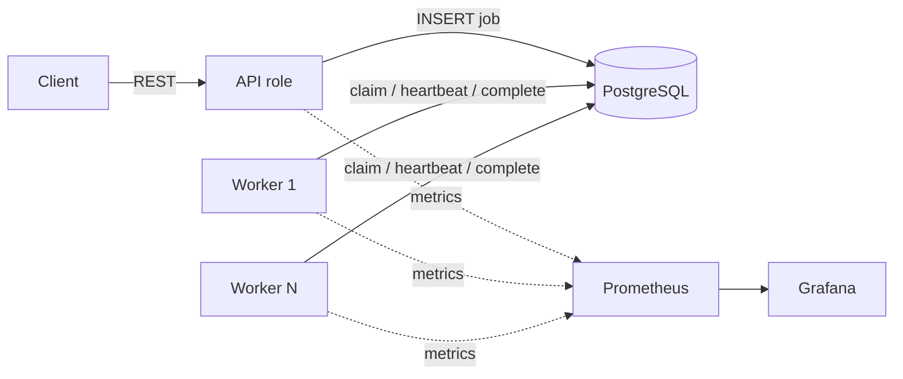
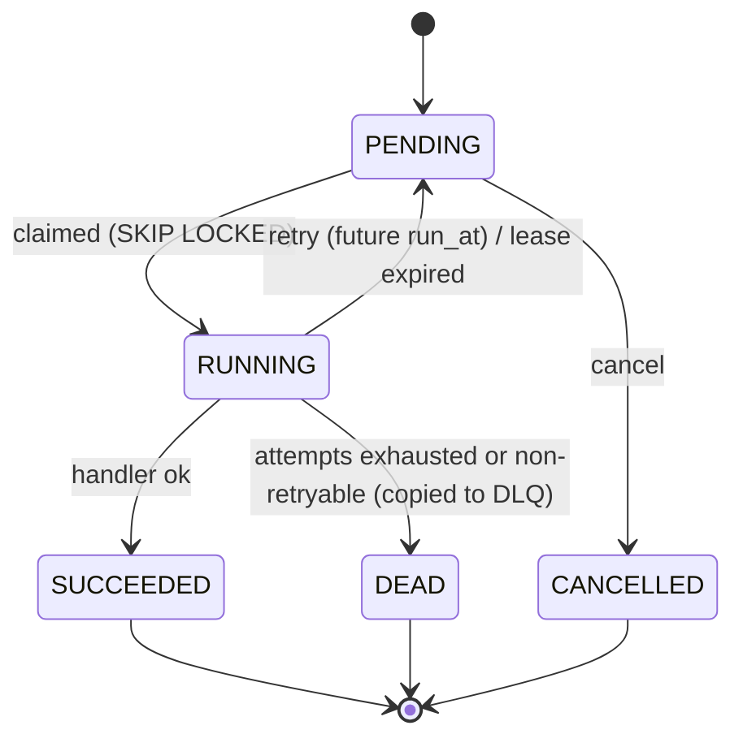

# Durable Job Queue

[](https://github.com/Octavian-Mihai/job-queue/actions/workflows/ci.yml)

A durable, horizontally scalable background job queue built on PostgreSQL alone (no Redis/Kafka),
in Java 21 + Spring Boot. Workers claim jobs with `SELECT ... FOR UPDATE SKIP LOCKED`, hold
heartbeat-extended leases, retry with exponential backoff and jitter, and dead-letter jobs that
exhaust their attempts. The goal is correctness under failure, backed by measured results.

> **Status: phase 8 of 9 (load tests).** Everything through the full test suite plus k6 load tests,
> measured results and a zero-lost-jobs verification. Final polish (design-decisions write-up, known
> limitations, resume bullets) is phase 9.

## Architecture



One codebase, two roles chosen by `JOBQUEUE_ROLES` (`api`, `worker`, or `api,worker`).

## Job state machine



## Quickstart

```bash
docker compose up --build --scale worker=4
curl localhost:8080/actuator/health
```

Enqueue and inspect (OpenAPI docs: `http://localhost:8080/swagger-ui/index.html`):

```bash
curl -i -XPOST localhost:8080/jobs -H 'Content-Type: application/json' \
  -H 'Idempotency-Key: order-42-welcome-email' \
  -d '{"type":"send-email","payload":{"to":"a@b.c"},"priority":5,"delaySeconds":10,"maxAttempts":3}'
# repeat the same command: 200 with the same job instead of 201 and a duplicate

curl localhost:8080/jobs/<id>                                  # job + attempt history
curl 'localhost:8080/jobs?status=PENDING&type=send-email&size=20'
curl -XPOST localhost:8080/jobs/<id>/cancel                    # 409 unless still PENDING
```

Errors are RFC 7807 `application/problem+json` (validation failures include an `errors` map).

Host ports are overridable if they clash with something else: `API_PORT`, `POSTGRES_PORT`,
`PROMETHEUS_PORT`, `GRAFANA_PORT`. Prometheus: `:9090`, Grafana: `:3000` (anonymous admin; dashboard **Job Queue** is provisioned).

Local development (needs Docker for Testcontainers):

```bash
./mvnw verify          # format check, tests against real Postgres, coverage report
./mvnw spotless:apply  # auto-format
```

## Schema notes

`jobs.priority`: higher value is claimed first. A DB `CHECK` guarantees a `RUNNING` row always has
`locked_by` and `lease_expires_at`, and no other state does. `dead_letter_jobs` has no foreign key
to `jobs` on purpose, so DLQ records survive cleanup of old job rows.

## Idempotency

`POST /jobs` with an `Idempotency-Key` header runs
`INSERT ... ON CONFLICT (idempotency_key) DO NOTHING RETURNING id` against a unique index. Two
concurrent requests serialize on the index: one inserts (201), the other waits for it, inserts
nothing, and reads the winner's row (200). There is no check-then-insert window. A test fires 32
simultaneous requests with one key and asserts exactly one row and one 201. A repeated key returns
the *existing* job even if the new request body differs (it does not compare payloads).

## Workers

A worker (`JOBQUEUE_ROLES=worker`, or both roles in one process) runs one poller thread that claims
jobs in batches and runs each on a virtual thread. A semaphore bounds in-flight jobs, and the poller
never claims more than it has free slots. When idle it backs off from `poll-interval` up to
`max-poll-interval`; a full batch triggers an immediate re-poll to drain a backlog.

The claim is one SQL statement (`JobClaimRepository.claim`): `SELECT ... FOR UPDATE SKIP LOCKED`
picks and locks runnable rows in priority order, an `UPDATE` marks them `RUNNING` with an owner,
lease and incremented `attempts`, and an `INSERT` records the `job_attempts` row, all atomically.
Completion and failure updates are **fenced** on `locked_by` and the attempt number.

| Env var | Default | Meaning |
|---|---|---|
| `JOBQUEUE_WORKER_CONCURRENCY` | 8 | max jobs running at once per process |
| `JOBQUEUE_WORKER_BATCH_SIZE` | 10 | max jobs per claim |
| `JOBQUEUE_WORKER_POLL_INTERVAL` | 200ms | poll period while busy |
| `JOBQUEUE_WORKER_MAX_POLL_INTERVAL` | 1s | idle backoff ceiling (= worst-case pickup delay after idle) |
| `JOBQUEUE_WORKER_LEASE_DURATION` | 30s | how long a claim stays valid without a heartbeat |
| `JOBQUEUE_WORKER_HEARTBEAT_INTERVAL` | lease / 3 | how often in-flight leases are extended |
| `JOBQUEUE_WORKER_REAPER_INTERVAL` | 5s | how often expired leases are reclaimed |
| `JOBQUEUE_WORKER_SHUTDOWN_GRACE_PERIOD` | 30s | how long a stopping worker waits for in-flight jobs |
| `JOBQUEUE_WORKER_QUEUES` | all | comma-separated queue names to consume |

### Demo handlers

| Type | Behaviour | Payload |
|---|---|---|
| `send-email` | simulated SMTP, random transient failures; **idempotent** via `email_outbox` keyed by job id | `to`, `subject`, `simulate` (`random`/`ok`/`transient`/`after-send`) |
| `generate-report` | burns CPU then sleeps | `cpuMs`, `sleepMs` |
| `deliver-webhook` | simulated HTTP: 70% ok, 20% transient (503/timeout), 10% permanent (400/410) | `url`, `simulate` (`random`/`ok`/`transient`/`permanent`) |

Add a handler by implementing `JobHandler` as a Spring bean. Throw `RetryableException` or
`NonRetryableException` to classify failures; anything else is retried. Enqueueing an unknown
`type` is rejected with 400.

## Retries, timeouts and the dead-letter queue

**Backoff** (`BackoffPolicy`, pure and unit-tested): after failed attempt *n* the delay is uniform in
`[0, min(max-delay, base-delay x multiplier^(n-1))]`, i.e. exponential with **full jitter** and a
cap. Jitter keeps jobs that failed together from retrying in synchronized waves; the trade-off is that a
single retry can be nearly immediate. Settings are per job type with fallback to defaults
(`jobqueue.retry.defaults.*`, `jobqueue.retry.types.<type>.*`: `base-delay`, `multiplier`,
`max-delay`, `max-attempts`, `execution-timeout`) and are validated at startup. A request's
`maxAttempts` overrides the type default.

**Classification** (`FailureClassifier`): `NonRetryableException` goes straight to the DLQ,
`RetryableException` retries, and **anything unknown is retried** (dead-lettering on an unanticipated
bug would lose work a later attempt or a deploy may complete). The nearest classified exception in the
cause chain wins.

**Timeouts:** each attempt runs under its type's `execution-timeout`. On expiry the job's thread is
interrupted and the attempt is recorded as `TIMED_OUT` (a failed, retryable attempt). A handler that
ignores interruption keeps its slot busy (Java cannot kill a thread), which bounds concurrency and
prevents an overlapping second run of the same job.

**Dead-letter queue:** when a job dies (`NON_RETRYABLE` or `MAX_ATTEMPTS_EXCEEDED`) it is copied to
`dead_letter_jobs` in the same transaction as the status change. Replay creates a **new job** with a
fresh attempt cycle, marks the entry `replayed_at`/`replayed_job_id`, and leaves the original DEAD job
as history. One atomic statement with `replayed_at IS NULL` + `FOR UPDATE SKIP LOCKED` makes
double-replay impossible even under concurrent requests.

```bash
curl 'localhost:8080/dlq?type=deliver-webhook&reason=MAX_ATTEMPTS_EXCEEDED&replayed=false'
curl localhost:8080/dlq/<id>                       # entry + full attempt history
curl -XPOST localhost:8080/dlq/<id>/replay         # 201 new job, 409 if already replayed
curl -XPOST 'localhost:8080/dlq/replay?type=deliver-webhook&limit=500'   # oldest first
```

## Leases, crash recovery and graceful shutdown

**Lease + heartbeat.** A claim sets `lease_expires_at = now() + lease`. One batched `UPDATE` per
worker every `lease/3` extends every in-flight job it still owns (`WHERE locked_by = me AND attempts
= n`). If the heartbeat finds a claim is gone (the job was reclaimed), it interrupts that zombie
handler instead of letting it burn work. An attempt whose execution timeout fired stops being
heartbeated, so a handler that ignores interruption cannot hold its job forever.

**Reaper.** Every worker runs it; there is no leader. One statement (`FOR UPDATE SKIP LOCKED`)
finds `RUNNING` jobs with an expired lease, returns them to `PENDING` (or `DEAD` + DLQ when attempts
are exhausted) and closes their attempt row as `LEASE_EXPIRED`. Concurrent reapers split the work
without double-reclaiming, and the race with a late heartbeat resolves cleanly in either order. All
expiry checks use the **database clock**, so clock skew between machines cannot cause premature
expiry. **A crash consumes an attempt**: a job that keeps killing its worker (OOM, poison payload)
must eventually be dead-lettered rather than loop forever.

**Fencing.** Completion, failure, heartbeat and release only apply `WHERE status='RUNNING' AND
locked_by = <me> AND attempts = <my attempt>`. A "zombie" that was paused (GC, partition) past its
lease and wakes up cannot overwrite the new owner's result; its report is rejected and logged. The
attempt number matters even when the same worker id reclaims the job. See `FencingTest`.

**Graceful shutdown** (`SIGTERM`): stop claiming; keep heartbeating while in-flight jobs finish, up
to the grace period; then interrupt stragglers and hand their leases back immediately. Unlike a
crash, a graceful release **does not consume an attempt** (the counter and the half-finished attempt
row are rolled back), so rolling deploys can never dead-letter a job. Keep Docker/Kubernetes
termination grace (compose: `stop_grace_period: 60s`) and `spring.lifecycle.timeout-per-shutdown-phase`
above the worker grace period.

Observed in the compose stack (2 workers, 6s lease; informal check, not a benchmark): 16 ten-second jobs,
one worker `SIGKILL`ed mid-flight: all 16 reached `SUCCEEDED`, 8 attempts were closed `LEASE_EXPIRED`
and re-run on the survivor. A `SIGTERM` with 8 jobs in flight and a 5s grace period released all 8
back to `PENDING` with `attempts = 0`.

## Observability

`GET /stats` returns counts by status, the age of the oldest runnable pending job and the DLQ size.
Prometheus scrapes `/actuator/prometheus` on the API and every worker (workers are discovered through
compose DNS, so `--scale worker=N` just works). Logs are one JSON object per line in compose, with
`job_id` and `worker_id` from the MDC on every job log line.

| Metric | Type | Notes |
|---|---|---|
| `jobqueue_jobs{status}` | gauge | queue depth by status. Queue-wide: aggregate with `max()`, not `sum()` |
| `jobqueue_oldest_pending_age_seconds` | gauge | longest wait of a runnable pending job; the "keeping up?" signal |
| `jobqueue_dlq_size` | gauge | dead letters not yet replayed |
| `jobqueue_jobs_in_flight` | gauge | per process; aggregate with `sum()` |
| `jobqueue_attempts_total{type,outcome}` | counter | processed/failed: `SUCCEEDED`, `FAILED_RETRYABLE`, `FAILED_NON_RETRYABLE`, `TIMED_OUT` |
| `jobqueue_jobs_retried_total{type}` | counter | failed attempts that requeued the job |
| `jobqueue_jobs_dead_total{type,reason}` | counter | jobs entering the DLQ |
| `jobqueue_jobs_enqueued_total{type}` / `..._enqueue_duplicates_total` | counter | accepted vs idempotent replays |
| `jobqueue_leases_reclaimed_total{type,result}` | counter | reaper reclaims after a crash |
| `jobqueue_fenced_total{operation}` / `jobqueue_heartbeat_lost_total` | counter | zombie writes rejected / leases found lost |
| `jobqueue_job_enqueue_to_start_seconds` | histogram | `claim time - run_at` (database clock), i.e. queue wait; measured from `run_at` so delayed/retried jobs show queueing, not their scheduled delay |
| `jobqueue_job_execution_seconds{type,outcome}` | histogram | handler wall time |

Queue gauges are computed from the database on scrape (cached 2 s); `GROUP BY status` scans `jobs`,
which is fine here but is one of the things to replace at scale (see limitations).

## Testing

Everything runs against a real PostgreSQL via Testcontainers (no H2). `./mvnw verify` runs the unit and
integration tests, then packages the jar and runs the real-process test, then the coverage gate.

| Requirement | Test |
|---|---|
| Backoff/jitter math, state transitions, retry classification | `BackoffPolicyTest`, `JobStatusTest`, `FailureClassifierTest`, `RetryPoliciesTest` |
| 8 workers, 5,000 jobs: all terminal, never executed concurrently | `MultiWorkerTest` (8 independent worker loops; asserts 1 execution and 1 closed attempt per job, 0 overlaps, all 8 workers used) |
| Mixed outcomes under 8 workers lose nothing, leave no open attempt | `MultiWorkerTest` |
| A worker process killed mid-job: job reclaimed and finished elsewhere | `CrashRecoveryIT` (two `java -jar` processes, one `SIGKILL`ed) and `WorkerLifecycleTest` |
| Fencing: stale worker rejected | `FencingTest` (zombie complete/fail, same-worker-id stale attempt, late report after requeue/finish) |
| Retries; always-failing job ends in DLQ with full attempt history; replay | `WorkerLoopTest`, `ClaimRepositoryTest`, `DlqApiTest` (incl. 16 concurrent replays of one entry) |
| Idempotency: concurrent submissions with one key create one job | `EnqueueApiTest` (32 threads) |
| Graceful shutdown: in-flight jobs finish or leases are released | `GracefulShutdownTest` |
| Heartbeats, reaper, crash vs. graceful accounting | `LeaseRepositoryTest`, `WorkerLifecycleTest` |
| Metrics and `/stats` | `JobMetricsTest`, `MetricsAndStatsTest` |

Several of these were also checked by mutation (temporarily removing `SKIP LOCKED`, the attempt-number
fence, the heartbeat, or the replay guard and confirming the corresponding tests fail).

**Coverage gate:** the build fails below 80% line / 70% branch coverage on the queue itself
(`core`, `worker`, `retry`, `handler`). Measured at the time of writing: 95.5% lines, 86.0% branches.
The API controllers, config and metrics glue are tested but not part of the gate. The gate is verified
to fail when the threshold is raised, so it cannot pass vacuously.

## Load test and results

Reproduce: `loadtest/run-all.sh` (matrix, 3 repetitions each), `loadtest/run-extra.sh`,
`loadtest/run-steady.sh`, then `loadtest/summarize.py`. Raw per-run JSON, k6 output and CPU samples are in
[`loadtest/results/`](loadtest/results). k6 runs from the official `grafana/k6` image.

**Machine and caveats (read before quoting any number).** MacBook with an Apple M3 (8 cores), 16 GB
RAM, macOS 27.0, Docker Desktop (VM: 8 CPUs, 8 GB). Everything shares that one machine: k6, the API,
the workers, an untuned PostgreSQL 16 in a container, Prometheus and Grafana, plus an unrelated idle
container stack (under 3% CPU when sampled). So these are **relative** numbers, not capacity claims for
real hardware. The handlers are simulated (`send-email`: 20-80 ms of sleep and one idempotent insert, no
real CPU work), so per-worker throughput reflects queue overhead plus that latency, not business logic.
Each scenario ran **3 times**; cells show *median [min-max]*. Every run starts from a fresh stack and
database, so JVM warm-up is included. End-to-end latency is `finished_at - created_at` from the database
(one clock). Scenarios: **burst** offers 500 jobs/s for 30 s so 1-2 workers fall behind; **steady** offers
100 jobs/s for 45 s (below one worker's capacity); **drain** pre-fills 20,000 jobs directly in Postgres to
measure pure processing capacity with no enqueue load; **kill** is described below.

**Burst: 500 jobs/s offered for 30 s (enqueue and processing share one Postgres)**

| Workers | Runs | enqueue/s (achieved) | enqueue p95 (ms) | dropped by k6 | jobs/min processed | e2e p50 (s) | e2e p95 (s) |
|---|---|---|---|---|---|---|---|
| 1 | 3 | 488 [465-494] | 156 [84-380] | 348 [189-1053] | 8281 [8248-8301] | 40.9 [39.2-41.1] | 73.4 [67.7-73.8] |
| 2 | 3 | 450 [424-500] | 542 [13-761] | 1480 [4-2291] | 14060 [13326-17634] | 17.6 [11.4-17.6] | 26.7 [20.2-27.1] |
| 4 | 3 | 489 [449-498] | 168 [35-1482] | 339 [48-1543] | 26686 [24575-29092] | 3.5 [3.2-4.9] | 4.8 [4.5-5.7] |

**Steady: 100 jobs/s for 45 s (default idle poll ceiling: 1 s)**

| Workers | Runs | enqueue/s | enqueue p95 (ms) | e2e p50 (s) | e2e p95 (s) |
|---|---|---|---|---|---|
| 1 | 3 | 100 [100-100] | 7 [4-12] | 0.06 [0.06-0.07] | 0.10 [0.10-0.30] |
| 2 | 3 | 100 [100-100] | 6 [5-8] | 0.06 [0.06-0.06] | 0.10 [0.10-0.10] |
| 4 | 3 | 100 [100-100] | 6 [5-47] | 0.06 [0.06-0.07] | 0.09 [0.09-0.18] |

**Steady, previous default idle poll ceiling of 5 s (same load)**

| Workers | Runs | enqueue/s | enqueue p95 (ms) | e2e p50 (s) | e2e p95 (s) |
|---|---|---|---|---|---|
| 1 | 3 | 100 [100-100] | 35 [11-178] | 0.08 [0.08-1.39] | 3.80 [3.24-4.73] |
| 2 | 3 | 100 [100-100] | 6 [5-22] | 0.06 [0.06-0.07] | 0.24 [0.12-0.74] |
| 4 | 3 | 100 [100-100] | 12 [8-20] | 0.07 [0.06-0.07] | 0.29 [0.10-2.62] |

**Steady, idle poll ceiling of 500 ms (same load)**

| Workers | Runs | enqueue/s | e2e p50 (s) | e2e p95 (s) |
|---|---|---|---|---|
| 1 | 3 | 100 [100-100] | 0.06 [0.06-0.06] | 0.11 [0.10-0.11] |

**Enqueue only: API with no workers, 1,500 jobs/s offered for 20 s**

| Workers | Runs | enqueue/s (achieved) | enqueue p50 (ms) | enqueue p95 (ms) | enqueue p99 (ms) | dropped by k6 |
|---|---|---|---|---|---|---|
| 0 | 3 | 1477 [1431-1481] | 0.7 [0.7-1.5] | 15 [14-261] | 234 [217-507] | 456 [373-1373] |

**Drain: 20,000 jobs pre-filled, no enqueue load (pure processing capacity)**

| Workers | Runs | window (s) | jobs/min | jobs/min per worker |
|---|---|---|---|---|
| 1 | 3 | 136 [134-139] | 8830 [8632-8969] | 8830 [8632-8969] |
| 2 | 3 | 66 [66-67] | 18074 [17810-18185] | 9037 [8905-9093] |
| 4 | 3 | 35 [34-36] | 34500 [33069-35384] | 8625 [8267-8846] |

**Kill: 100 emails/s + 12 slow (2 s) reports/s for 60 s; one of 4 workers SIGKILLed at t+25 s (10 s lease)**

| Workers | Runs | accepted (201) | succeeded | lost | jobs running when killed | attempts reclaimed (LEASE_EXPIRED) | e2e p95 (s) | e2e max (s) |
|---|---|---|---|---|---|---|---|---|
| 4 | 3 | 6722 [6722-6722] | 6722 [6722-6722] | 0 [0-0] | 8 [7-8] | 8 [8-8] | 7.9 [7.7-9.8] | 15.3 [15.3-19.1] |

Zero-lost-jobs verification: 45 runs, ALL PASSED.

### What the numbers say

- **Processing scales near-linearly with workers** when nothing else competes: about 8.6-9.0k jobs/min
  per worker (about 147 jobs/s, close to the 160/s ceiling of 8 slots at ~50 ms per job), giving 8.8k,
  18.1k and 34.5k jobs/min for 1, 2 and 4 workers (1.0x, 2.05x, 3.9x). Mid-run CPU samples (single
  snapshots, not averages) showed Postgres at about 16%, 23% and 50% of one core and each worker at
  roughly 15-25%, so the database was not the limit at these rates: the simulated handler latency was.
- **Under burst, enqueue and processing compete.** The API alone sustained about 1,480 enqueues/s
  (p95 15 ms), but while workers were draining it managed only about 450-490/s with p95 from 13 ms to
  1.5 s and k6 dropping up to ~2,300 scheduled requests in the worst run, because the API and workers
  share one Postgres and one machine. The 4-worker burst row is limited by the arrival rate (it drained
  almost as fast as jobs arrived), so its jobs/min understates 4-worker capacity: use the drain table.
  End-to-end latency in burst is dominated by the backlog (it is queue wait, not processing time).
- **At 100 jobs/s the queue adds about 0.1 s at p95** for every worker count (p50 about 60 ms, which is
  the handler's own ~50 ms). The tail is the idle-poll ceiling (below), not contention.
- **Crash during load loses nothing.** One of 4 workers was `SIGKILL`ed at t+25 s while holding 7-8
  running jobs; across 3 runs all accepted jobs (6,722 each) reached `SUCCEEDED`, 8 attempts per run were
  reclaimed via lease expiry and re-run elsewhere (max e2e 15-19 s, about the 10 s lease plus queueing),
  and the outbox held exactly one email per succeeded send-email job despite the re-runs.
- **Zero lost jobs:** in all 45 runs the number of jobs the API accepted (HTTP 201) equalled the number in
  a terminal state, nothing was left `PENDING`/`RUNNING`, nothing was dead-lettered, and every succeeded
  `send-email` job had exactly one email (`collect.py` checks all of this and fails the run otherwise).

### Problems the load test found (and fixed)

1. **Saturated workers refilled slots only once per poll interval.** My first calibration run
   (1 worker, 500 jobs/s) processed about **2,287 jobs/min**; after waking the poller
   as soon as a slot frees it processed about **7,726 jobs/min** (3.4x; single runs
   each, in `loadtest/results/calibration/`). The old loop capped throughput at roughly
   `concurrency / poll-interval` however fast the handlers were. `SlotRefillTest` reproduces it (the old
   loop needs ~6.9 s to drain 100 jobs under a 500 ms poll interval, the fix about 1 s).
2. **The idle-poll backoff ceiling was a latency floor.** With the original 5 s ceiling, one worker at
   100 jobs/s had an end-to-end **p95 of 3.8 s** (median 0.08 s): jobs arriving after a quiet period waited
   for the next poll. Capping the backoff at 500 ms gave p95 0.11 s (same load, 3 runs each), which
   confirmed the cause, so the default is now 1 s (p95 about 0.1 s above). The cost is one trivial query
   per second per idle worker. The structural fix is `LISTEN/NOTIFY` (see trade-offs).
3. **My first kill scenario often killed a worker that held nothing** (median 0 reclaimed attempts over 3
   runs), so it proved little. It now keeps worker slots busy with a trickle of slow jobs so the victim
   always holds work (the superseded runs are in `loadtest/results/superseded/`).
