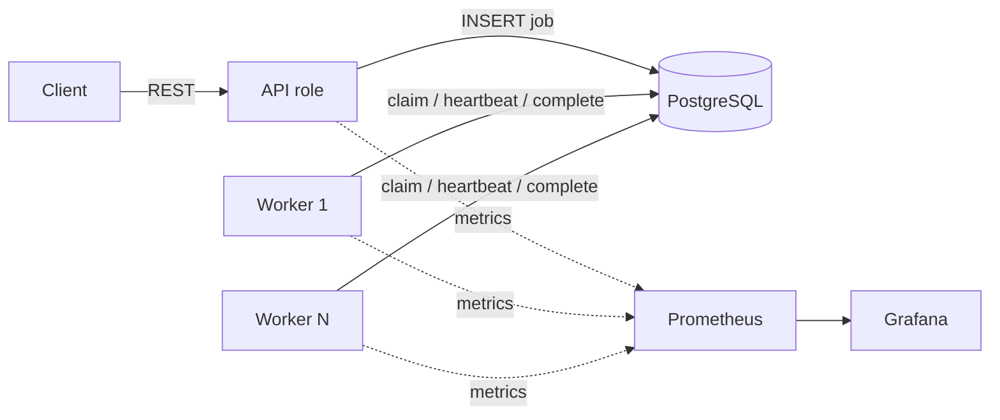
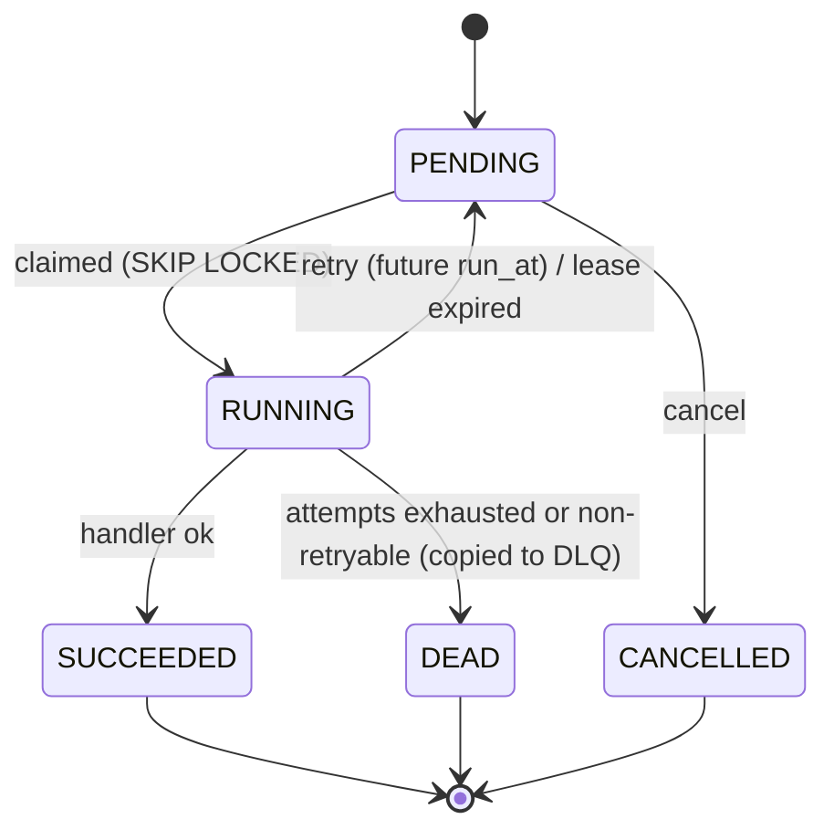

# Durable Job Queue

[](https://github.com/Octavian-Mihai/job-queue/actions/workflows/ci.yml)

A durable, horizontally scalable background job queue built on PostgreSQL alone (no Redis/Kafka),
in Java 21 + Spring Boot. Workers claim jobs with `SELECT ... FOR UPDATE SKIP LOCKED`, hold
heartbeat-extended leases, retry with exponential backoff and jitter, and dead-letter jobs that
exhaust their attempts. The goal is correctness under failure, backed by measured results.

> **Status: phase 1 of 9 (skeleton).** Schema, compose stack, health endpoint and CI exist;
> the queue logic is built in later phases. Sections below grow as phases land.

## Architecture



One codebase, two roles chosen by `JOBQUEUE_ROLES` (`api`, `worker`, or `api,worker`).

## Job state machine



## Quickstart

```bash
docker compose up --build --scale worker=4
curl localhost:8080/actuator/health
```

Host ports are overridable if they clash with something else: `API_PORT`, `POSTGRES_PORT`,
`PROMETHEUS_PORT`, `GRAFANA_PORT`. Prometheus: `:9090`, Grafana: `:3000`.

Local development (needs Docker for Testcontainers):

```bash
./mvnw verify          # format check, tests against real Postgres, coverage report
./mvnw spotless:apply  # auto-format
```

## Schema notes

`jobs.priority`: higher value is claimed first. A DB `CHECK` guarantees a `RUNNING` row always has
`locked_by` and `lease_expires_at`, and no other state does. `dead_letter_jobs` has no foreign key
to `jobs` on purpose, so DLQ records survive cleanup of old job rows.
