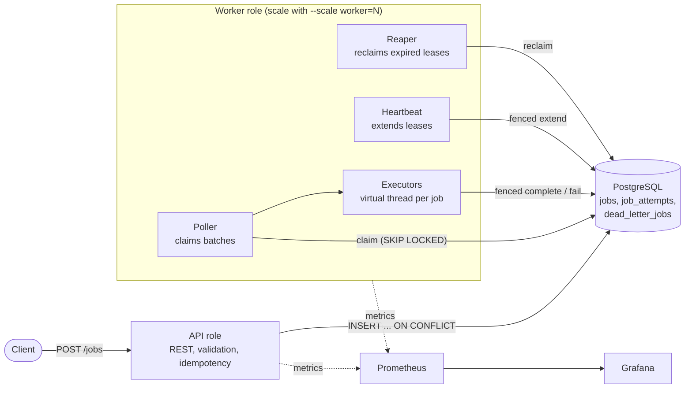
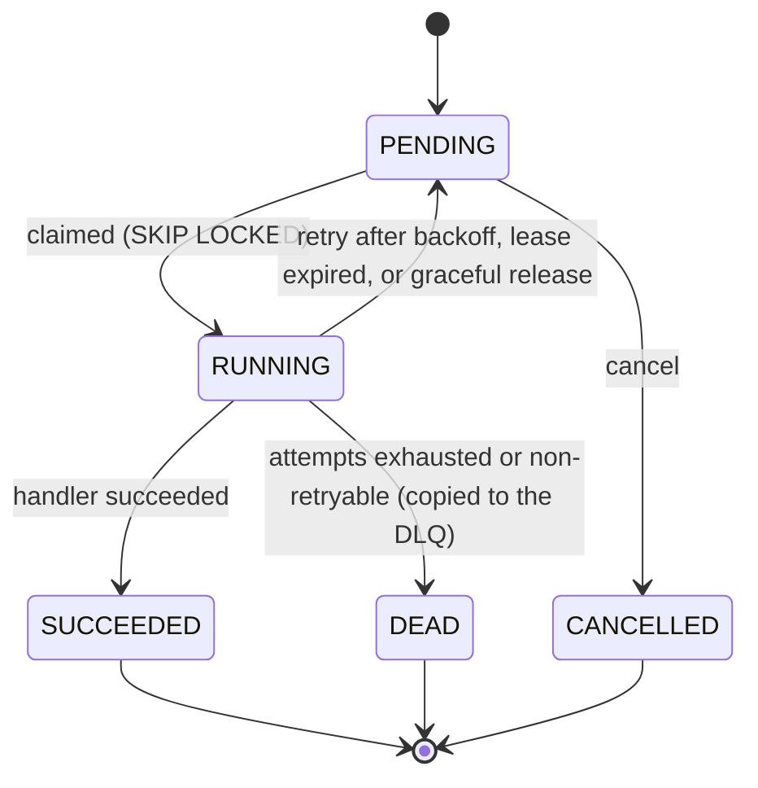

# Durable Job Queue

[](https://github.com/Octavian-Mihai/job-queue/actions/workflows/ci.yml)

A durable, horizontally scalable background job queue built on **PostgreSQL alone** (no Redis, Kafka or
RabbitMQ), in Java 21 and Spring Boot, with the queue logic written from scratch (no Quartz, JobRunr or
similar). Workers claim jobs in batches with `SELECT ... FOR UPDATE SKIP LOCKED`, hold leases that a
heartbeat keeps alive, retry with exponential backoff and jitter, and dead-letter jobs that run out of
attempts, with inspect and replay. If a worker dies mid-job, another reclaims the job when its lease
expires, and every state change is **fenced** so a stalled "zombie" worker can never overwrite the new
owner's result. The point of the project is correctness under failure, backed by measurements: across 42
load-test runs (422,405 jobs, including runs where a worker was `SIGKILL`ed mid-flight) no accepted job
was lost.

## Architecture



One codebase, two roles chosen by `JOBQUEUE_ROLES` (`api`, `worker`, or `api,worker` for a single
local process).

### Job state machine



`DEAD` is terminal: replaying a dead-letter entry creates a **new** job.

## Quickstart

```bash
docker compose up --build --scale worker=4
curl localhost:8080/actuator/health
```

Postgres, the API, four workers, Prometheus (`:9090`) and Grafana (`:3000`, dashboard **Job Queue** is
provisioned) start together. If a port is taken, override `API_PORT`, `POSTGRES_PORT`,
`PROMETHEUS_PORT` or `GRAFANA_PORT`. The compose file is for local use: default credentials and
anonymous Grafana admin are not production settings.

Enqueue and inspect (OpenAPI docs at `http://localhost:8080/swagger-ui/index.html`):

```bash
curl -i -XPOST localhost:8080/jobs -H 'Content-Type: application/json' \
  -H 'Idempotency-Key: order-42-welcome-email' \
  -d '{"type":"send-email","payload":{"to":"a@b.c"},"priority":5,"delaySeconds":10,"maxAttempts":3}'
# run it again: 200 with the same job instead of a 201 and a duplicate

curl localhost:8080/jobs/<id>                                   # job + attempt history
curl 'localhost:8080/jobs?status=PENDING&type=send-email&size=20'
curl -XPOST localhost:8080/jobs/<id>/cancel                     # 409 unless still PENDING
curl localhost:8080/stats                                       # counts by status, oldest pending age

curl 'localhost:8080/dlq?type=deliver-webhook&replayed=false'   # dead letters
curl localhost:8080/dlq/<id>                                    # entry + full attempt history
curl -XPOST localhost:8080/dlq/<id>/replay                      # 201 new job, 409 if already replayed
curl -XPOST 'localhost:8080/dlq/replay?type=deliver-webhook&limit=500'   # oldest first
```

Errors are RFC 7807 `application/problem+json`; validation failures carry an `errors` map. Try the
failure paths yourself: enqueue a few hundred `deliver-webhook` jobs (10% fail permanently, 20% transiently),
then `docker kill` a worker and watch the **Job Queue** dashboard and the DLQ.

Development (needs Docker for Testcontainers):

```bash
./mvnw verify          # format check, unit + integration tests on real Postgres, jar, crash test, coverage gate
./mvnw spotless:apply  # auto-format
```

## Results at a glance

**Headline (median of 3 runs per cell; details and ranges below)**

| Workers | Enqueue throughput (burst, jobs/s) | Enqueue p95 (burst, ms) | End-to-end p50 / p95 at 100 jobs/s (s) | Processing capacity (jobs/min) | per worker |
|---|---|---|---|---|---|
| 1 | 488 | 156 | 0.06 / 0.10 | 8,830 | 8,830 |
| 2 | 450 | 542 | 0.06 / 0.10 | 18,074 | 9,037 |
| 4 | 489 | 168 | 0.06 / 0.09 | 34,500 | 8,625 |

Measured on an Apple M3 laptop (8 cores, 16 GB) with everything on one machine (k6, API, workers, an
untuned Postgres 16 in Docker), **simulated handlers** (about 50 ms each) and 3 runs per cell. Treat the
numbers as relative, not as capacity claims for real hardware. Processing capacity (the drain scenario, with
no enqueue load) scales near-linearly with workers (1.0x, 2.05x, 3.9x). Enqueue throughput and p95 come from
the burst scenario, where enqueueing and processing compete for the same Postgres and machine (the API alone
sustained about 1,480 jobs/s). At 100 jobs/s the queue adds about 0.1 s at p95. All caveats, per-scenario tables with ranges, the crash-during-load
runs and the bugs the load test found are in **[loadtest/RESULTS.md](loadtest/RESULTS.md)**.

## How it works

**Claiming.** One SQL statement (`JobClaimRepository.claim`) picks runnable jobs with `FOR UPDATE SKIP
LOCKED` in priority order, marks them `RUNNING` with an owner, a lease and `attempts + 1`, and inserts the
`job_attempts` row, atomically. `SKIP LOCKED` is why two workers can never claim the same row and why they
do not queue behind each other: a locked row is skipped, not waited on. A worker runs one poller thread,
one virtual thread per job, and a semaphore that bounds in-flight jobs; the poller claims only as many jobs
as it has free slots and wakes as soon as a slot frees. When idle it backs off up to `max-poll-interval`.

**Leases, heartbeats and the reaper.** A claim sets `lease_expires_at = now() + lease`. Once per
`lease/3` a single batched `UPDATE` extends every job the worker still owns. If a heartbeat discovers a
claim is gone, it interrupts that zombie handler. The **reaper** (runs on every worker, no leader) finds
`RUNNING` jobs with an expired lease and returns them to `PENDING`, or to `DEAD` plus the DLQ if attempts
are exhausted, in one `SKIP LOCKED` statement, so concurrent reapers split the work. All expiry checks use
the **database clock**, so clock skew between machines cannot cause premature expiry. **A crash consumes an
attempt** (a job that keeps killing its worker must eventually be dead-lettered); a graceful release does not.

**Fencing.** Completion, failure, heartbeat and release only apply `WHERE status = 'RUNNING' AND locked_by
= <me> AND attempts = <my attempt>`. A worker that was paused past its lease and wakes up cannot overwrite the
result of whoever reclaimed the job; its write matches zero rows and is logged. The attempt number matters
even when the same worker id reclaims the job (`FencingTest`).

**Retries.** After failed attempt *n* the delay is uniform in `[0, min(max-delay, base-delay x multiplier^(n-1))]`:
exponential backoff with **full jitter** and a cap, per job type (`BackoffPolicy`, a pure unit-tested class).
`NonRetryableException` goes straight to the DLQ, `RetryableException` retries, and **unknown exceptions are
retried** (dead-lettering on an unanticipated bug would lose work a later attempt, or a deploy, might
complete). Each attempt runs under a per-type timeout; on expiry the thread is interrupted and the attempt is
recorded as `TIMED_OUT`.

**Dead-letter queue.** A job that dies is copied to `dead_letter_jobs` in the same transaction as the status
change, with a reason (`NON_RETRYABLE` or `MAX_ATTEMPTS_EXCEEDED`). Replay creates a **new** job with a fresh
attempt cycle, stamps `replayed_at`/`replayed_job_id`, and leaves the dead job as history. One atomic
statement (`replayed_at IS NULL` + `SKIP LOCKED`) makes double replay impossible, even under 16 concurrent
requests (`DlqApiTest`).

**Idempotent submission.** `POST /jobs` with an `Idempotency-Key` runs `INSERT ... ON CONFLICT
(idempotency_key) DO NOTHING RETURNING id` on a unique index. Concurrent requests serialize on the index: one
inserts (201), the others read the winner's row (200). There is no check-then-insert window; a test fires 32
simultaneous requests with one key and asserts exactly one row. A repeated key returns the existing job even if
the new body differs.

**Graceful shutdown (`SIGTERM`).** Stop claiming; keep heartbeating while in-flight jobs finish, up to the
grace period; then interrupt stragglers and hand their leases back immediately, **without consuming an
attempt**, so rolling deploys cannot dead-letter jobs. Keep the container's termination grace above the worker
grace period (compose sets `stop_grace_period: 60s` against a 30 s default).

**Handlers.** Implement `JobHandler` as a Spring bean; the registry keys it by job type and fails fast on
duplicates, and the API rejects unknown types with 400. Three demo handlers ship:

| Type | Behaviour | Payload |
|---|---|---|
| `send-email` | simulated SMTP with random transient failures; **idempotent** through `email_outbox` keyed by job id | `to`, `subject`, `simulate` (`random`/`ok`/`transient`/`after-send`) |
| `generate-report` | burns CPU then sleeps | `cpuMs`, `sleepMs` |
| `deliver-webhook` | simulated HTTP: 70% ok, 20% transient (503/timeout), 10% permanent (400/410) | `url`, `simulate` (`random`/`ok`/`transient`/`permanent`) |

### Configuration

Worker settings are environment variables (Spring relaxed binding of `jobqueue.worker.*`):

| Env var | Default | Meaning |
|---|---|---|
| `JOBQUEUE_ROLES` | `api,worker` | `api`, `worker` or both |
| `JOBQUEUE_WORKER_CONCURRENCY` | 8 | max jobs running at once per process |
| `JOBQUEUE_WORKER_BATCH_SIZE` | 10 | max jobs per claim |
| `JOBQUEUE_WORKER_POLL_INTERVAL` | 200ms | poll period while busy |
| `JOBQUEUE_WORKER_MAX_POLL_INTERVAL` | 1s | idle backoff ceiling = worst-case pickup delay after idle |
| `JOBQUEUE_WORKER_LEASE_DURATION` | 30s | how long a claim stays valid without a heartbeat |
| `JOBQUEUE_WORKER_HEARTBEAT_INTERVAL` | lease / 3 | how often in-flight leases are extended |
| `JOBQUEUE_WORKER_REAPER_INTERVAL` | 5s | how often expired leases are reclaimed |
| `JOBQUEUE_WORKER_SHUTDOWN_GRACE_PERIOD` | 30s | how long a stopping worker waits for in-flight jobs |
| `JOBQUEUE_WORKER_QUEUES` | all | comma-separated queue names to consume |

Retry policy lives in `application.yml` under `jobqueue.retry.defaults` and `jobqueue.retry.types.<type>`
(`base-delay`, `multiplier`, `max-delay`, `max-attempts`, `execution-timeout`), validated at startup.

## Design decisions and trade-offs

**Why PostgreSQL with `SKIP LOCKED`, not Redis or Kafka.** One datastore means one thing to run, back up and
reason about, and job state is durable and transactional: you can inspect the queue with SQL, and enqueueing
can share a transaction with business data, which removes the dual-write problem (write to the database
*and* publish to a broker, then one of them fails). The costs are real: every job is several writes (insert,
claim update, attempt insert, completion updates, plus WAL), so throughput is capped by a single Postgres
primary, and the queue competes with application queries for the same database. Redis-based queues are
faster but need separate infrastructure and have weaker durability by default. Kafka is a log, not a task
queue: it has no per-job retry, delay, priority or acknowledgement, only partition-ordered consumption. For
roughly thousands of jobs per second or fewer, Postgres is the simpler and safer choice; beyond that I would
move to a dedicated broker.

**Leases vs explicit acks.** A broker like RabbitMQ returns an unacknowledged message when the consumer's
connection drops. A database has no such link, and holding a row lock (an open transaction) for the whole
job would pin a connection and block vacuum for as long as the job runs. So a claim is *committed state with an
expiry*: liveness comes from heartbeats, and a crash is detected when the lease runs out. The trade-off is
recovery latency of up to one lease (30 s by default; in the kill runs the slowest job took 15-19 s with a 10 s
lease) and a tuning decision: too short and a long GC pause triggers a spurious reclaim. Fencing is what
makes a spurious reclaim safe rather than dangerous.

**Polling vs `LISTEN/NOTIFY`.** Polling is simple and robust, and needs no extra connection per worker.
`NOTIFY` is lossy (a notification sent while a worker is reconnecting is gone), so a fallback poll is needed
anyway, and it does not pass through transaction-mode connection poolers. The cost of polling is latency
after idle periods: the load test measured a 5 s idle ceiling adding ~3.7 s to p95 at low load, so the default
is 1 s (idle cost: one trivial query per second per worker). `LISTEN/NOTIFY` on top of the polling
fallback is the next step if sub-second pickup after idle matters.

**At-least-once, not exactly-once.** A job can run twice: a worker can finish the work and die before
recording success, or a paused worker can be reclaimed while still running. Exactly-once is not achievable
in general, because the handler's side effect and the database commit are two systems that cannot commit
atomically. So the contract is at-least-once, and handlers must be idempotent. `send-email` shows the
pattern: its "send" is an insert into `email_outbox` keyed by the stable job id, so a re-run finds the
effect already there. In the kill runs the re-run jobs left exactly one outbox row per succeeded email job.

**Why fencing matters.** Leases alone are not safe. A pause (GC, network partition) is exactly what makes a
lease expire, so the "dead" worker is often not dead: it wakes up believing it owns the job after someone
else has finished it. Without a check on write, it overwrites the correct result, or re-sends the email,
and the stale write silently wins. Making every write conditional on `locked_by` and the attempt number
turns that into a rejected write that is counted (`jobqueue_fenced_total`) and logged.

**Virtual thread per job, bounded by a semaphore.** Handlers are mostly blocking I/O, which virtual threads
handle cheaply, and the semaphore (not a pool size) caps in-flight work so a slow dependency cannot make a
worker claim more than it can run. A purely CPU-bound handler would be better on a bounded platform-thread
pool sized to the core count.

**Full jitter.** Jobs that fail together (a downstream outage) would otherwise retry in synchronized waves
that hit the recovering service at once. Uniform jitter spreads them across the window; the cost is that a
single retry can be almost immediate.

**A crash consumes an attempt; a graceful release does not.** A crash is ambiguous (infrastructure, or this
job's payload kills workers), so it counts toward `max-attempts` and a poison job ends in the DLQ. A graceful
stop is deliberate and the job did nothing wrong, so charging it would let routine deploys dead-letter jobs.

**Replay creates a new job.** It keeps the dead job as an immutable record, restarts attempt numbering
cleanly (the `(job_id, attempt_number)` uniqueness stays valid) and makes "replayed once" a single
conditional update.

**Explicit SQL for the hot paths.** Claiming, leasing and reaping use `JdbcTemplate` with CTEs and `SKIP
LOCKED`, which are hard to express in an ORM and where the exact statement is the design. JPA is not used
at all. **Maven**, because its declarative POM is what most Spring teams use and the wrapper needs no install.

## Delivery guarantees

- **At-least-once.** Every accepted job reaches a terminal state or is still queued; none is silently dropped.
  A job may run more than once (after a crash, a lost lease or a graceful release).
- **No exactly-once and no ordering guarantee.** Priority and `run_at` order claims within one claim
  statement, but with several workers, retries and `SKIP LOCKED` there is no global FIFO.
- **Duplicate submissions** are prevented only when the client sends an `Idempotency-Key`.
- **Handlers must be idempotent.** Use `JobContext.jobId()` (stable across attempts) as the dedupe key for side
  effects; `SendEmailHandler` is the worked example and `DemoHandlersTest` shows a lost-ack case producing
  exactly one email.

## Known limitations and what I'd do at larger scale

I have measured less than this list covers, so each item says what was and was not tested.

- **Throughput ceiling is one Postgres primary.** Measured: about 34.5k jobs/min with 4 workers on a laptop with
  ~50 ms simulated handlers, with Postgres at roughly half a core when sampled. I did not test beyond 4 workers
  or with real handlers, so I do not know where the database saturates. Each job costs several statements
  and WAL, so expect a ceiling in the low thousands of jobs per second on good hardware. At that point I would
  batch completion writes, put the queue on its own database, shard queues across databases, or move
  high-volume fire-and-forget work to a broker and keep Postgres for jobs that need transactional enqueue.
- **No retention or cleanup.** Finished jobs, attempts, outbox rows and dead letters accumulate forever. The
  `jobs` table is also update-heavy (several updates per job), which creates dead tuples and bloat, and
  the status columns are indexed so many updates cannot be HOT. At scale: partition `jobs` by time and drop old
  partitions, tune autovacuum and fillfactor, and make cleanup skip jobs that have a DLQ entry (the DLQ's attempt
  history currently lives on the `jobs` rows and cascades with them). Idempotency keys never expire either.
- **Polling latency.** A job arriving after an idle spell waits up to `max-poll-interval` (1 s by default), and
  idle workers poll once per second. `LISTEN/NOTIFY` with a polling fallback would remove most of it.
- **Statistics scan the table.** `/stats` and the queue gauges run `GROUP BY status` on scrape (cached 2 s).
  Fine here; at large scale use maintained counters or planner estimates.
- **Strict priority can starve low-priority jobs**, and there is no per-queue or per-tenant fairness, rate
  limiting or per-type concurrency limit.
- **Timeouts rely on interruption.** Java cannot kill a thread, so a handler that ignores interrupts keeps its slot
  and its job can be reclaimed and run again elsewhere while the first copy is still running (allowed by
  at-least-once, and the reason handlers must be idempotent). Running handlers in separate processes would allow
  real kills.
- **Reclaimed jobs requeue immediately.** A poison job can crash a worker `max-attempts` times in quick
  succession before reaching the DLQ; a backoff on reclaim would soften that.
- **Recovery latency is one lease** (30 s default), and the lease/heartbeat values are conventional choices, not
  tuned by measurement.
- **Unknown-type rejection at enqueue** prevents typos but can reject valid jobs during a rolling deploy where
  the API is newer than the workers (or the reverse).
- **Single points of failure and security.** One Postgres is a single point of failure (use Patroni or a managed
  multi-AZ database; a failover makes heartbeats fail and leases expire, which at-least-once tolerates). The
  API has no authentication or TLS, and there is no payload size limit beyond the web server's.
- **Smaller gaps:** offset pagination (keyset would scale better), no recurring/cron jobs or job dependencies,
  no cancellation of *running* jobs (the lost-lease interrupt path could carry it), and `replay all` can create a
  large batch at once (capped by `limit`).
- **Benchmark caveats.** One laptop, one container for Postgres, simulated handlers, 3 runs per scenario,
  JVM warm-up included. Enqueue p95 varied a lot between runs under burst (13 ms to 1.5 s) because the API and
  workers shared the database and machine.

## Observability

`GET /stats` and Prometheus metrics at `/actuator/prometheus` on the API and every worker (workers are
discovered through compose DNS, so scaling needs no config). Logs in compose are one JSON object per line
with `job_id` and `worker_id` on every job line.

| Metric | Type | Notes |
|---|---|---|
| `jobqueue_jobs{status}` | gauge | queue depth by status; queue-wide, so aggregate with `max()`, not `sum()` |
| `jobqueue_oldest_pending_age_seconds` | gauge | longest wait of a runnable pending job: the "is it keeping up?" signal |
| `jobqueue_dlq_size` | gauge | dead letters not yet replayed |
| `jobqueue_jobs_in_flight` | gauge | per process; aggregate with `sum()` |
| `jobqueue_attempts_total{type,outcome}` | counter | `SUCCEEDED`, `FAILED_RETRYABLE`, `FAILED_NON_RETRYABLE`, `TIMED_OUT` |
| `jobqueue_jobs_retried_total{type}` / `jobqueue_jobs_dead_total{type,reason}` | counter | requeued after failure / entered the DLQ |
| `jobqueue_jobs_enqueued_total{type}` / `..._enqueue_duplicates_total` | counter | accepted vs idempotent replays |
| `jobqueue_leases_reclaimed_total{type,result}` | counter | reaper reclaims after a crash |
| `jobqueue_fenced_total{operation}` / `jobqueue_heartbeat_lost_total` | counter | zombie writes rejected / leases found lost |
| `jobqueue_job_enqueue_to_start_seconds` | histogram | `claim time - run_at` (database clock): queue wait |
| `jobqueue_job_execution_seconds{type,outcome}` | histogram | handler wall time |

The provisioned dashboard has 15 panels in four sections: is the queue keeping up, throughput, latency, and
failures and recovery.

## Testing

Everything runs against a real PostgreSQL via Testcontainers (no H2). `./mvnw verify` runs the unit and
integration tests, packages the jar, runs the real-process crash test, then the coverage gate; CI runs the
same plus the Docker image build.

| Requirement | Test |
|---|---|
| Backoff/jitter math, state transitions, retry classification | `BackoffPolicyTest`, `JobStatusTest`, `FailureClassifierTest`, `RetryPoliciesTest` |
| 8 workers, 5,000 jobs: all terminal, never executed concurrently | `MultiWorkerTest` (8 independent worker loops; one execution and one closed attempt per job, 0 overlaps, all 8 workers used) |
| Mixed outcomes under 8 workers lose nothing, leave no open attempt | `MultiWorkerTest` |
| A worker process killed mid-job: job reclaimed and finished elsewhere | `CrashRecoveryIT` (two `java -jar` processes, one `SIGKILL`ed), `WorkerLifecycleTest` |
| Fencing: stale worker rejected | `FencingTest` (zombie complete/fail, same-worker-id stale attempt, late report after requeue or finish) |
| Retries; always-failing job ends in the DLQ with full history; replay | `WorkerLoopTest`, `ClaimRepositoryTest`, `DlqApiTest` (incl. 16 concurrent replays of one entry) |
| Idempotency: concurrent submissions with one key create one job | `EnqueueApiTest` (32 threads) |
| Graceful shutdown: in-flight jobs finish or leases are released | `GracefulShutdownTest` |
| Heartbeats, reaper, crash vs graceful accounting | `LeaseRepositoryTest`, `WorkerLifecycleTest` |
| Saturated worker refills slots promptly (a load-test regression) | `SlotRefillTest` |
| Metrics and `/stats` | `JobMetricsTest`, `MetricsAndStatsTest` |

Several safety properties were also checked by mutation: temporarily removing `SKIP LOCKED` (jobs ran up to 4
times and the 5,000-job test failed), the attempt-number fence, the heartbeat, or the replay guard each made the
corresponding tests fail.

**Coverage gate:** the build fails below 80% line and 70% branch coverage on the queue itself (`core`,
`worker`, `retry`, `handler`). Measured at the time of writing: 95.5% lines, 86.0% branches. API controllers,
config and metrics glue are tested but not gated. The gate was verified to fail when the threshold is raised, so
it cannot pass vacuously.

## Project layout

```
src/main/java/dev/jobqueue/
  api/       REST controllers, request/response types, RFC 7807 error handling
  core/      job model, repositories, enqueue/cancel/DLQ services (explicit SQL)
  worker/    claim query, worker loop, executor, heartbeat, reaper, lease SQL, fencing
  retry/     backoff policy and per-type retry configuration (pure, unit-tested)
  handler/   JobHandler SPI, registry, exceptions, demo handlers
  metrics/   Micrometer metrics and queue gauges
  config/    roles, properties, OpenAPI
src/main/resources/db/migration/   Flyway schema
docker/                            Prometheus config, Grafana provisioning and dashboard
loadtest/                          k6 script, run/collect/summarize scripts, raw results, RESULTS.md
```
